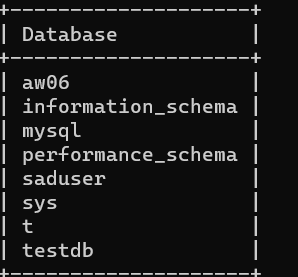
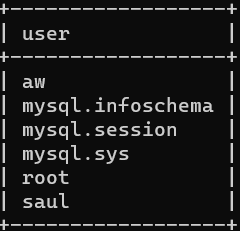

# SpringBatch实验报告

| 学号      | 姓名   |
| --------- | ------ |
| 191220162 | 张乐简 |

[TOC]

## 概述

​		利用springbatch将json文件中的数据转化为POJO，接着将POJO存入mysql数据库中，最后修改AW04中完成的POS系统，使其从数据库中获取数据。

## 实验内容

### Spring Batch

​		为方便调试修改，直接将AW06作业仓库中的示例项目下载下来，在其基础上进行修改。新项目在batch文件夹下。另外，由于两个json文件太大无法上传至github，只好在提交时删除。

#### 准备数据


​		选取两个较小的category，将json文件放在resource目录下。

​		简单浏览一下这两个json文件。

```json
{"category": [], "tech1": "", "description": ["Loud 'N Clear Personal Sound Amplifier allows you to turn up the volume on what people around you are saying, listen at the level you want without disturbing others, hear a pin drop from across the room."], "fit": "", "title": "Loud 'N Clear&trade; Personal Sound Amplifier", "also_buy": [], "tech2": "", "brand": "idea village", "feature": [], "rank": "2,938,573 in Beauty & Personal Care (", "also_view": [], "details": {"ASIN: ": "6546546450"}, "main_cat": "All Beauty", "similar_item": "", "date": "", "price": "", "asin": "6546546450", "imageURL": [], "imageURLHighRes": []}
```

​		如上，这是其中的一项。由此对Product类进行修改，使它可以承载我需要的信息。

```java
package com.example.batch.model;

import com.fasterxml.jackson.annotation.JsonIgnoreProperties;
import lombok.Data;

import javax.persistence.Entity;
import javax.persistence.Id;
import java.util.List;

@Data
@JsonIgnoreProperties(ignoreUnknown = true)
public class Product {
    private String main_cat;
    private String title;
    private String asin;
    private String price;
    private List<String> category;
    private List<String> imageURLHighRes;
}
```

#### 修改BatchConfig

​		原版的示例项目读取一个json文件，而现在需要读取两个；原版的项目读取的文件路径与现在的也不同。因此，需要对BatchConfig做一些修改。

​		为了读取两个项目，需要有两个ItemReader类型的Bean，分别用于读取不同文件。

```java
    @Bean
    public ItemReader<JsonNode> itemReader() {
        return new JsonFileReader("./src/main/resources/data/meta_All_Beauty.json");
    }
	...

    @Bean
    public ItemReader<JsonNode> itemReader2() {
        return new JsonFileReader("./src/main/resources/data/meta_Appliances.json");
    }
```

​		另外，也需要两个processProduct来完成两个Step。

```java
    @Bean
    protected Step processProducts() {
        return stepBuilderFactory.get("processProducts").<JsonNode, Product>chunk(20)
                .reader(itemReader())
                .processor(itemProcessor())
                .writer(itemWriter())
                .taskExecutor(taskExecutor())
                .build();
    }
    @Bean
    protected Step processProducts2() {
        return stepBuilderFactory.get("processProducts2").<JsonNode, Product>chunk(20)
                .reader(itemReader2())
                .processor(itemProcessor())
                .writer(itemWriter())
                .taskExecutor(taskExecutor())
                .build();
    }
```

​		最后再在Job中添加两个Step。

```java
    @Bean
    public Job chunksJob() {
        return jobBuilderFactory
                .get("chunksJob")
                .incrementer(new RunIdIncrementer())
                .start(processProducts())
                .next(processProducts2())
                .build();
    }
```

#### 配置MySql

​		一个Step由ItemReader，ItemProcessor和ItemWriter组成，前面两个的改动已经完成，现在来配置ItemWriter。为此，首先要配置用于存储数据的数据库。

​		首先在application.properties里写明需要的dataSource。

```properties
spring.datasource.url=jdbc:mysql://127.0.0.1:3306/aw06
spring.datasource.username=aw
spring.datasource.password=123
spring.datasource.driver-class-name=com.mysql.jdbc.Driver
spring.jpa.database-platform=org.hibernate.dialect.MySQL5InnoDBDialect
mybatis.config-location=classpath:mybatis-config.xml
spring.batch.initialize-schema=ALWAYS
```

​		倒数第二行的属性指名了待会要用的mybatis的配置文件的路径，最后一行是为了让程序不要无视一些BATCH，总是去执行它们。

​		接着在数据库里创建对应的数据库和user。



​		

​		最后，要为数据库建表。如下是resources/schema.sql。

```sql
DROP TABLE  IF EXISTS Products;
DROP TABLE  IF EXISTS ProductCategory;
DROP TABLE  IF EXISTS  ProductImageURL;

CREATE TABLE IF NOT EXISTS Products(
    asin VARCHAR(100) NOT NULL,
    main_cat VARCHAR(1000),
    title VARCHAR(1000) NOT NULL,
    price VARCHAR(10000),
    category VARCHAR(1000),
    imageURL VARCHAR(1000)
);

```

​		我试着去指定主键，但总是发现重复的，于是暂且不管。为了调试方便，我在脚本最上方加了DROP TABLE的命令，用于删除可能会存在的表。

#### 配置MyBatis

​		我使用MyBatis访问数据库。首先对其进行配置：

```xml
<?xml version="1.0" encoding="UTF-8" ?>
<!DOCTYPE configuration
        PUBLIC "-//mybatis.org//DTD Config 3.0//EN"
        "http://mybatis.org/dtd/mybatis-3-config.dtd">
<configuration>
    <environments default="development">
        <environment id="development">
            <transactionManager type="JDBC"/>
            <dataSource type="POOLED">
                <property name="driver" value="${driver}"/>
                <property name="url" value="${url}"/>
                <property name="username" value="${username}"/>
                <property name="password" value="${password}"/>
            </dataSource>
        </environment>
    </environments>

    <mappers>
        <mapper resource="repository/mappers/ProductMapper.xml"/>
    </mappers>

</configuration>
```

​		配置很简单，只是指定了dataSource和mapper。接下来，为了访问数据编写Mapper。这里只需要存Product类型的数据，所以将所有东西都存在ProductMapper里。

```java
@Mapper
public interface ProductMapper {

    public void insertProduct(String asin,String main_cat,String title,String price,String category,String imageURL);

    public void insertProductCategory(String asin,String title,String category);

    public void insertProductImageURL(String asin,String title,String imageURL);
}

```

​		由于一些商品可能有多个category和imgeurl，一开始时我建了三张表，但是读取速度实在太慢无法忍受，所以就先取第一个category和imageurl，全部放到一张Products表里。因此Mapper里也留有其余两张表的接口。

​		接着在xml文件中编写SQL语句。

```xml
<?xml version="1.0" encoding="UTF-8" ?>
<!DOCTYPE mapper
        PUBLIC "-//mybatis.org//DTD Mapper 3.0//EN"
        "http://mybatis.org/dtd/mybatis-3-mapper.dtd">
<mapper namespace="com.example.batch.mapper.ProductMapper">
    <select id="insertProduct">
        INSERT INTO Products VALUES (#{asin},#{main_cat},#{title},#{price},#{category},#{imageURL});
    </select>
    <select id="insertProductCategory">
        INSERT INTO ProductCategory VALUES (#{asin},#{title},#{category});
    </select>
    <select id="insertProductImageURL">
        INSERT INTO ProductImageURL VALUES (#{asin},#{title},#{imageURL});
    </select>
</mapper>
```

​			使用select和insert的效果似乎一样，让我有些困惑。

#### 修改ItemWriter

​		为了方便使用Mapper，再加一个ProductInserter类用于解析Product数据并存入数据库。

```java
@Component
public class ProductInserter {
    @Autowired
    ProductMapper productMapper;
    public Boolean insertProduct(Product product){
        String asin=product.getAsin();
        String main_cat=product.getMain_cat();
        String title=product.getTitle();
        String price=product.getPrice();
        List<String> categories=product.getCategory();
        List<String> imageURLS=product.getImageURLHighRes();
        String category="";
        String imageURL="";
        if(!categories.isEmpty()){
            category=categories.get(0);
        }
        if(!imageURLS.isEmpty()) {
            imageURL = imageURLS.get(0);
        }
        productMapper.insertProduct(asin,main_cat,title,price,category,imageURL);


        return true;
    }
}
```

​		ItemWriter里直接用它存入数据。

```java
    @Override
    public void write(List<? extends Product> list) throws Exception {
        for (Product product:
             list) {
            productInserter.insertProduct(product);
        }
    }
```

### 修改AW04

​		配置MySql和MyBatis的过程大同小异，不再赘述。

#### 编写Mapper

​		只需要一个将所有Product都取出的Mapper即可。

```xml
<?xml version="1.0" encoding="UTF-8" ?>
<!DOCTYPE mapper
        PUBLIC "-//mybatis.org//DTD Mapper 3.0//EN"
        "http://mybatis.org/dtd/mybatis-3-mapper.dtd">
<mapper namespace="com.example.webpos.mapper.ProductMapper">
    <select id="getProducts" resultType="com.example.webpos.model.ProductDAO">
        SELECT * FROM PRODUCTS;
    </select>
    <select id="getImageURL" resultType="String">
        SELECT imageURL
        FROM PRODUCTIMAGEURL
        WHERE asin=#{asin} AND title=#{title};
    </select>
</mapper>
```

​		getImageURL是原本使用三张表时使用的接口。由于查询返回了一个集合的值，我暂时没法找到直接调用Mapper来获取返回值的方法，只好采用生成session的方式。

```java
    public List<Product> parseJD(String keyword) throws IOException {
        List<Product> products=new ArrayList<>();
        List<ProductDAO> daos=new ArrayList<>();
        //从数据库获取数据
        try (SqlSession session = sqlSessionFactory.openSession()) {
            daos = session.selectList("com.example.webpos.mapper.ProductMapper.getProducts");
        }
        for (ProductDAO dao:daos
        ) {
            String asin=dao.getAsin();
            String main_cat=dao.getMain_cat();
            String title=dao.getTitle();
            String url=dao.getImageURL();
            String priceS=dao.getPrice();
            Double price=0.0;
            try{
                if(!priceS.equals("")){
                    price=Double.parseDouble(priceS.substring(1));
                }
                products.add(new Product(asin,title,price,url));
            }catch (Exception e){
                System.out.println(e);
                products.add(new Product(asin,title,0,url));
            }

        }
        return products;
    }
```

​		以上函数原先从京东扒数据，现在直接从数据库读数据。测试一下结果。


​		加载了相当长的时间，但结果正确。